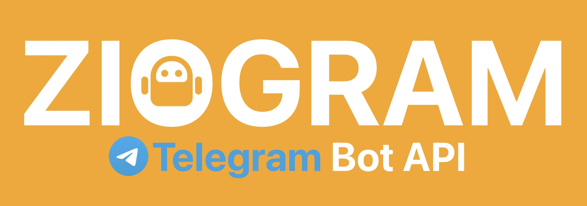

<div align="center">
<p>
  <a href="https://ziglang.org/download/"></a>
  <a href="https://core.telegram.org/bots/api"></a>
  <a href="COVERAGE.md"></a>
  <a href="https://opensource.org/licenses/MIT"></a>
</p>

<p>
  <a href="#-quick-start">🚀 Quick Start</a> ·
  <a href="#-downloading-a-file">📁 Downloading a File</a> ·
  <a href="#-local-bot-api-server-support">🖥 Local Bot API</a> ·
  <a href="#%EF%B8%8F-error-handling">⚠️ Error Handling</a> ·
  <a href="#-bots-using-ziogram">🤖 Bots using Ziogram</a>
</p>

</div>

---

## 📦 Installation

### Prerequisites

- Zig 0.16.0+ [(Download here)](https://ziglang.org/download/)
- A valid [Telegram Bot Token](https://core.telegram.org/bots/features#botfather)

### Steps

**1.** Create a new project and add ziogram as a dependency:
```sh
mkdir my_project
cd my_project
zig init
zig fetch --save git+https://github.com/atcoun/ziogram.git
```

**2.** Open `build.zig` in your `my_project`, add the module before the executable definition:
```zig
const dep = b.dependency("ziogram", .{
    .target = target,
    .optimize = optimize,
});
const ziogram = dep.module("ziogram");
```
Then add it to your `my_project` executable imports:
```zig
.{ .name = "ziogram", .module = ziogram },
```

**3.** Write your first bot in `src/main.zig`:
```zig
const std = @import("std");

const ziogram = @import("ziogram");
const ClientSession = ziogram.ClientSession;
const Bot = ziogram.Bot;

pub fn main(init: std.process.Init) !void {
    const arena = init.arena;
    const allocator = init.gpa;
    const io = init.io;

    var session = try ClientSession.init(allocator, io, .{});
    defer session.deinit();

    var bot = try Bot.init("YOUR_BOT_TOKEN", &session);
    defer bot.deinit();

    const me = try bot.getMe(arena, .{});
    const info = try std.json.Stringify.valueAlloc(arena.allocator(), me, .{
        .whitespace = .indent_4,
        .emit_null_optional_fields = false,
    });
    std.log.info("{s}", .{info});
}
```

**4.** Run in debug mode (default):
```sh
zig build run
```
Run in release mode (production):
```sh
zig build run -Doptimize=ReleaseSafe
```

---

## 🚀 Quick Start

### Long Polling
See [examples/echo_bot.zig](examples/echo_bot.zig)

### Webhook
See [examples/echo_bot_webhook.zig](examples/echo_bot_webhook.zig)

---

### ✉️ Sending a Message

```zig
const message = try bot.sendMessage(arena, .{
    .chat_id = .{ .id = 123456789 }, // or .{ .username = "@username" }
    .text = "Hello from <b>ziogram</b>! ⚡",
    .parse_mode = .HTML,
});

std.log.info("Sent message id: {d}", .{message.message_id});
```

> [!NOTE]
> `.{ .username = "@username" }` works for public groups and channels. For private chats, Telegram requires a numeric `user_id` — the bot must have received at least one message from the user first.

---

### 🖼️ Sending a Photo

`InputFile` is a versatile union that automatically selects the correct transport (multipart vs. JSON) based on the input type. It supports the local filesystem, in-memory buffers, existing `file_id`s, or remote URLs with byte-streaming support.

```zig
// 1. Upload a file from the local filesystem
// The filename is automatically extracted from the path.
_ = try bot.sendPhoto(arena, .{
    .chat_id = .{ .id = 1234567890 }, // or .{ .username = "@username" }
    .photo = .{ .fs = .{ .path = "assets/ziogram.png" } },
    .caption = "Hello from Zig!",
});

// 2. Send using an existing file_id (fastest method)
_ = try bot.sendPhoto(arena, .{
    .chat_id = .{ .id = 1234567890 },
    .photo = .{ .file_id = "AgACAgIAAxkBAAI..." },
});

// 3. Streaming from a remote URL (aiogram-style)
// The bot downloads the file and proxies its bytes to Telegram.
_ = try bot.sendPhoto(arena, .{
    .chat_id = .{ .id = 1234567890 },
    .photo = .{ .url = .{ 
        .url = "https://ziglang.org",
        .filename = "logo.svg", // Optional: override filename
        .headers = .{ .user_agent = .{ .override = "Ziogram/1.0" } }, // Optional: custom headers
    }},
});

// 4. Upload from an in-memory buffer
// Filename is required for buffers so Telegram knows the file extension.
_ = try bot.sendPhoto(arena, .{
    .chat_id = .{ .id = 1234567890 },
    .photo = .{ .buffer = .{ 
        .data = my_buffer_slice, 
        .filename = "chart.jpg" 
    }},
});
```

---

### 📁 Downloading a File

Two methods are available depending on what you already have.

**`Bot.download`** — high-level helper. Pass a `file_id`; the library calls `getFile` internally and streams the bytes to any `std.Io.Writer`.

```zig
fn downloadToFile(
    arena: *std.heap.ArenaAllocator,
    bot: Bot,
    file_id: []const u8,
    filename: []const u8,
) !void {
    const io = bot.session.io;

    const out_file = try std.Io.Dir.cwd().createFile(io, filename, .{
        .truncate = true,
    });
    defer out_file.close(io);

    var write_buf: [64 * 1024]u8 = undefined;
    var file_writer = out_file.writer(io, &write_buf);

    try bot.download(arena, file_id, &file_writer.interface, .{});

    std.log.info("File saved: {s}", .{filename});
}
```

**`Bot.downloadFile`** — low-level variant. Use it when you already have a `file_path` from a `File` object returned by `getFile`.

```zig
const file_meta = try bot.getFile(arena, .{ .file_id = some_file_id });
const path = file_meta.file_path orelse return error.TelegramFileTooLarge;

try bot.downloadFile(arena, path, &writer.interface, .{});
```

---

### 🖥 Local Bot API Server Support

Running your own [Telegram Bot API server](https://github.com/tdlib/telegram-bot-api)? Ziogram supports it out of the box, including local file path remapping between the server and your machine:

```zig
var session = try ClientSession.init(allocator, io, .{
    .server = .{
        .base = "http://127.0.0.1:8081",
        .is_local = true,
        .wrap_local_file = .{
            .simple = .{
                .server_path = "/var/lib/telegram-bot-api/",
                .local_path = "/mnt/storage/",
            },
        },
    },
});
defer session.deinit();
```

When `is_local` is true, `downloadFile` reads directly from disk instead of making an HTTP request.

---

### 🔀 JSON + Multipart in One Interface

Ziogram automatically picks the right content type. If a method has any `InputFile` field, it uses `multipart/form-data`. Otherwise, it sends `application/json`. You never think about this.

---

### ✅ Token Validation

Tokens are validated on `bot.init()` — format, separator, numeric ID — before any network request is made.

---

### ⚠️ Error Handling

All errors are typed. Telegram-specific errors carry a `DetailedError` with a human-readable message and a docs URL, logged automatically before the error is returned.

```zig
bot.sendMessage(arena, .{ .chat_id = .{ .id = id }, .text = "hi" }) catch |err| {
    switch (err) {
        error.TelegramForbiddenError => std.log.err("Bot was blocked", .{}),
        error.TelegramRetryAfter     => std.log.err("Rate limited — check logs for retry_after", .{}),
        error.TelegramBadRequest     => std.log.err("Bad request", .{}),
        else                         => return err,
    }
};
```

Full error set:

| Error | Trigger |
|---|---|
| `TelegramBadRequest` | HTTP 400 |
| `TelegramUnauthorizedError` | HTTP 401 — invalid token |
| `TelegramForbiddenError` | HTTP 403 — bot blocked / no access |
| `TelegramNotFound` | HTTP 404 |
| `TelegramConflictError` | HTTP 409 — another polling instance running |
| `TelegramEntityTooLarge` | HTTP 413 — file too big |
| `TelegramServerError` | HTTP 5xx |
| `TelegramRetryAfter` | Flood control — `retry_after` in response parameters |
| `TelegramMigrateToChat` | Group migrated to supergroup |
| `ClientDecodeError` | JSON decode failure |
| `NameServerFailure` | DNS resolution failed |

---

## 🤖 Bots using Ziogram
 
Bots built with this library. Want to add yours? Open an [issue](https://github.com/atcoun/ziogram/issues) or PR with your bot's username and a short description.
 
> No bots yet — be the first!
 
---

## 🤝 Contributing

Missing something in ziogram? Don't worry — ideas, changes, bug fixes, and questions are all welcome!

See [CONTRIBUTING.md](CONTRIBUTING.md) for details on how to get started.

---

## 📄 License

This project is licensed under the **MIT License** — see the [LICENSE](LICENSE) file for details.

---

<div align="center">

### Star the project ⭐
**If you find this library useful, please give it a star! It helps more developers discover ziogram.**

Built with ❤️ and ⚡ by [atcoun](https://github.com/atcoun) · [ziogram](https://github.com/atcoun/ziogram)

</div>
