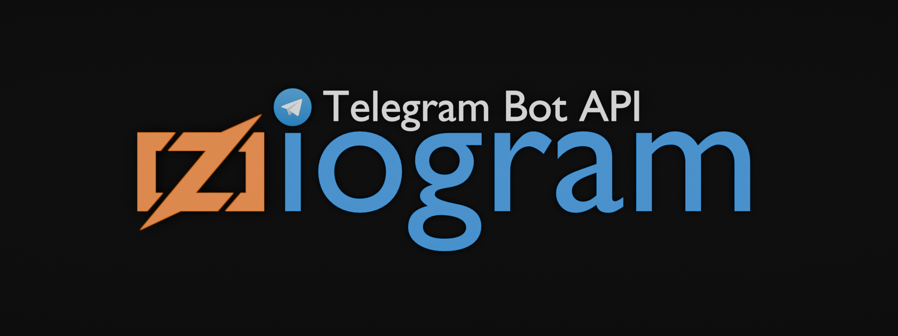

<div align="center">




**A Telegram Bot API library written in Zig ⚡**
 
[📦 Installation](#-installation) · [🚀 Quick Start](#-quick-start) · [📂 Examples](#-examples) · [🖥 Local Bot API](#-local-bot-api-server-support) · [⚠️ Error Handling](#%EF%B8%8F-error-handling)
 
</div>

---

> [!WARNING]
> Not recommended for production-critical environments. Since Zig has not yet reached v1.0.0, API stability and backward compatibility are subject to change. This library is provided "as is", without warranty of any kind, express or implied. Use at your own risk.

---

## 📦 Installation

### Prerequisites

- Zig 0.16.0+ [(Download here)](https://ziglang.org/download/)
- A valid [Telegram Bot Token](https://t.me/BotFather)

### Steps

**1.** Create a new project and add ziogram as a dependency:
```sh
mkdir my_project
cd my_project
zig init
zig fetch --save git+https://github.com/atcoun/ziogram.git
```

**2.** Open `build.zig` in your `my_project`, find the executable definition and add the module:
```zig
const dep = b.dependency("ziogram", .{
    .target = target,
    .optimize = optimize,
});
const ziogram = dep.module("ziogram");

const exe = b.addExecutable(.{
    .name = "my_project",
    .root_module = b.createModule(.{
        .root_source_file = b.path("src/main.zig"),
        .target = target,
        .optimize = optimize,
        .imports = &.{
            .{ .name = "ziogram", .module = ziogram },
        },
    }),
});
```

**3.** Write your first bot in `src/main.zig`:
```zig
const std = @import("std");
const ziogram = @import("ziogram");

pub fn main(init: std.process.Init) !void {
    var client = try ziogram.Client.init(init.gpa, init.io, .{});
    defer client.deinit();

    var bot = try ziogram.Bot.init("YOUR_BOT_TOKEN", client, .{});
    defer bot.deinit();

    const allocator = init.arena.allocator();

    const me = try bot.getMe(allocator, .{});

    const info = try std.json.Stringify.valueAlloc(allocator, me, .{
        .whitespace = .indent_4,
        .emit_null_optional_fields = false,
    });
    std.log.info("{s}", .{info});
}
```

**4.** Run:
```sh
zig build run
```

---

## 🚀 Quick Start

### Long Polling
See [examples/echo_bot.zig](examples/echo_bot.zig)

### Webhook
See [examples/echo_bot_webhook.zig](examples/echo_bot_webhook.zig)

---

### Sending a Message

```zig
const msg = try bot.sendMessage(allocator, .{
    .chat_id = .{ .id = 123456789 }, // or .{ .username = "@username" }
    .text = "Hello from <b>ziogram</b>! ⚡",
    .parse_mode = .HTML,
});

std.log.info("Sent message id: {d}", .{msg.message_id});
```

> [!NOTE]
> `.{ .username = "@username" }` works for public groups and channels. For private chats, Telegram requires a numeric `user_id` — the bot must have received at least one message from the user first.

---

### Sending a Photo

`InputFile` accepts a filesystem path, an in-memory buffer, a `file_id`, or a URL — the transport (multipart vs JSON) is selected automatically.

```zig
// Upload a file from the local filesystem
_ = try bot.sendPhoto(allocator, .{
    .chat_id = .{ .id = 1234567890 }, // or .{ .username = "@username" }
    .photo = .fromPath("media/photo.png"),
    .caption = "Sent via ziogram",
});

// Send a photo using a remote URL or an existing file_id
_ = try bot.sendPhoto(allocator, .{
    .chat_id = .{ .id = 1234567890 },
    .photo = .{ .url = "https://example.com" }, // or .file_id = "..."
});

// Upload a file from an in-memory buffer
const photo_file = try InputFile.fromPathBuffered(io, allocator, "media/photo.png");
_ = try bot.sendPhoto(allocator, .{
    .chat_id = .{ .id = 1234567890 },
    .photo = photo_file,
});

// Or wrap an existing in-memory buffer directly:
_ = try bot.sendPhoto(allocator, .{
    .chat_id = .{ .id = 1234567890 },
    .photo = InputFile.fromBuffer(my_buffer, "photo.png"),
});
```

---

### Downloading a File

Two methods are available depending on what you already have.

**`Bot.download`** — high-level helper. Pass a `file_id`; the library calls `getFile` internally and streams the bytes to any `std.Io.Writer`.

```zig
var file = try std.Io.Dir.cwd().createFile(io, "photo.jpg", .{});
defer file.close(io);

var buf: [65536]u8 = undefined;
var writer = file.writer(io, &buf);

try bot.download(allocator, some_file_id, &writer.interface);
```

**`Bot.downloadFile`** — low-level variant. Use it when you already have a `file_path` from a `File` object returned by `getFile`.

```zig
const file_meta = try bot.getFile(allocator, .{ .file_id = some_file_id });
const path = file_meta.file_path orelse return error.TelegramFileTooLarge;

try bot.downloadFile(allocator, path, &writer.interface);
```

---

### ⚙️ Bot Options

Set once on `Bot.init` — applied to every method call that supports the field, unless overridden per-call.

```zig
var bot = try Bot.init(token, client, .{
    .parse_mode = .HTML,
    .disable_notification = true,
    .protect_content = true,
    .link_preview_is_disabled = true,
});

// parse_mode = .HTML is applied automatically from bot options:
_ = try bot.sendMessage(allocator, .{
    .chat_id = .{ .id = 123456789 },
    .text = "Message with <b>bold</b> and <u>underline</u>",
});

// Override per-call with .None to send plain text:
_ = try bot.sendMessage(allocator, .{
    .chat_id = .{ .id = 123456789 },
    .text = "Message without <b>bold</b> and <u>underline</u>",
    .parse_mode = .None,
});
```

---
### 🖥 Local Bot API Server Support

Running your own [Telegram Bot API server](https://github.com/tdlib/telegram-bot-api)? Ziogram supports it out of the box, including local file path remapping between the server and your machine:

```zig
var api= try TelegramAPI.init(allocator, "http://localhost:8081", true, .{
    .server_path = "/var/lib/telegram-bot-api/",
    .local_path   = "/mnt/storage/",
});
defer api.deinit(allocator);

var client = try Client.init(allocator, io, .{ .api = api });
defer client.deinit();
```

When `is_local` is true, `downloadFile` reads directly from disk instead of making an HTTP request.

---

### 🔀 JSON + Multipart in One Interface

Ziogram automatically picks the right content type. If a method has any `InputFile` field, it uses `multipart/form-data`. Otherwise, it sends `application/json`. You never think about this.

---

### ✅ Token Validation

Tokens are validated on `bot.init()` — format, separator, numeric ID — before any network request is made.

---

### ⚠️ Error Handling

All errors are typed. Telegram-specific errors carry a `DetailedError` with a human-readable message and a docs URL, logged automatically before the error is returned.

```zig
bot.sendMessage(allocator, .{ .chat_id = .{ .id = id }, .text = "hi" }) catch |err| {
    switch (err) {
        error.TelegramForbiddenError => std.log.err("Bot was blocked", .{}),
        error.TelegramRetryAfter     => std.log.err("Rate limited — check logs for retry_after", .{}),
        error.TelegramBadRequest     => std.log.err("Bad request", .{}),
        else                         => return err,
    }
};
```

Full error set:

| Error | Trigger |
|---|---|
| `TelegramBadRequest` | HTTP 400 |
| `TelegramUnauthorizedError` | HTTP 401 — invalid token |
| `TelegramForbiddenError` | HTTP 403 — bot blocked / no access |
| `TelegramNotFound` | HTTP 404 |
| `TelegramConflictError` | HTTP 409 — another polling instance running |
| `TelegramEntityTooLarge` | HTTP 413 — file too big |
| `TelegramServerError` | HTTP 5xx |
| `TelegramRetryAfter` | Flood control — `retry_after` in response parameters |
| `TelegramMigrateToChat` | Group migrated to supergroup |
| `ClientDecodeError` | JSON decode failure |
| `NameServerFailure` | DNS resolution failed |

---

## 🤝 Contributing

Missing something in ziogram? Don't worry — ideas, changes, bug fixes, and questions are all welcome!

See [CONTRIBUTING.md](CONTRIBUTING.md) for details on how to get started.

---

## 📄 License

This project is licensed under the **MIT License** — see the [LICENSE](LICENSE) file for details.

---

<div align="center">

### Star the project ⭐
**If you find this library useful, please give it a star! It helps more developers discover ziogram.**

Built with ❤️ and ⚡ by [atcoun](https://github.com/atcoun) · [ziogram](https://github.com/atcoun/ziogram)

</div>
